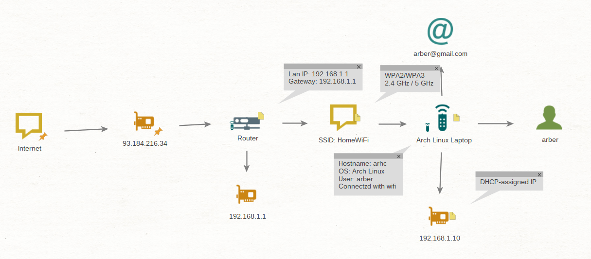
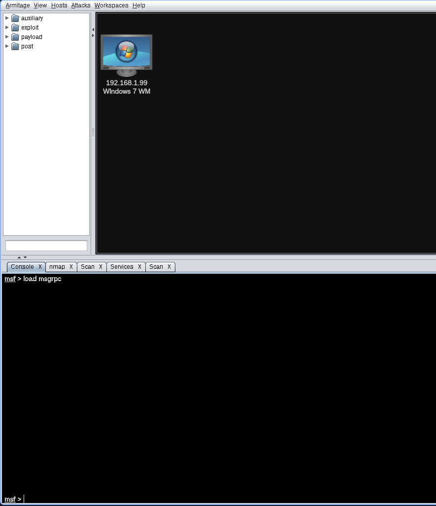

# Dokumentim i hartëzimit të rrjetit me Maltego dhe analizës së ekspozimit të një smartphone në laborator të kontrolluar

## Qëllimi

Qëllimi i kësaj detyre ishte modelimi i një rrjeti të thjeshtë shtëpiak me `Maltego`, përdorimi i kësaj skeme si input për fazën pasuese në `Armitage`, dhe dokumentimi i dallimeve midis një konfigurimi vulnerabël dhe një konfigurimi të sigurtë.

Gjithë aktiviteti u zhvillua në një mjedis të kontrolluar dhe të autorizuar, duke respektuar praktikën që testimet e sigurisë të kryhen vetëm mbi sisteme që zotërohen.

Dokumentimi u mbështet me shënime gjatë gjithë procesit dhe me screenshots të fazave kryesore, sepse mbajtja e evidencave vizuale e bën raportin më të qartë dhe më të vlefshëm për prezantim.

## Mjedisi i laboratorit

Mjedisi i përdorur për këtë detyrë përbëhej nga një router, një laptop `Arch Linux`, dhe një smartphone `Android`, të lidhur në të njëjtin rrjet lokal.
Për pikën e parë u përdor `Maltego` për të paraqitur entitetet dhe marrëdhëniet ndërmjet tyre në formë graph, ndërsa për pikën e dytë u përdor `Metasploit/Armitage` si mjedis laboratorik për simulimin dhe analizën e ekspozimit të pajisjes mobile.

## Pika 1 – Hartëzimi i rrjetit me Maltego

Në fazën e parë u krijua një graph në `Maltego`, ku u shtuan manualisht entitetet kryesore të rrjetit: `Internet`, `Public IP`, `Router`, `Gateway IP`, `Wi‑Fi SSID`, `Arch Linux Laptop`, `Laptop Private IP`, `Android Smartphone`, dhe `User Account`.

Qëllimi i kësaj faze ishte të paraqitej jo vetëm topologjia fizike, por edhe marrëdhëniet logjike ndërmjet pajisjeve, sepse `Maltego` është projektuar për të vizualizuar entitete dhe lidhje në formë grafike.

Për secilin entitet u shtuan atribute si `hostname`, `private IP`, `gateway`, `OS`, në mënyrë që skema të mos ishte thjesht vizuale, por edhe informuese për analizën e sigurisë.

Rrjeti u organizua në mënyrë lineare nga e majta në të djathtë: `Internet` -> `Public IP` -> `Router` -> `Wi‑Fi SSID` -> `Endpoint Devices`, sepse një strukturë e qartë vizuale e bën skemën më të lexueshëm dhe më të lehtë për t’u shpjeguar në raport.

Në anën e djathtë të graph u paraqitën pajisjet fundore, përfshirë laptopin Arch Linux dhe smartphone Android, ndërsa në pjesën qendrore u vendosën entitetet e infrastrukturës si Router dhe Gateway.
Rezultati final i pikës së parë ishte një skemë e plotë e rrjetit shtëpiak, e gatshme për t’u përdorur si input në analizën e fazës së dytë.



## Pika 2 – Konfigurimi i laboratorit me Metasploit/Armitage

Për shkak të problemeve të hasura me `Armitage GUI`, veçanërisht me funksionin `Find Attacks`, implementimi i pikës së dytë u realizua kryesisht përmes command line, duke përdorur `PostgreSQL`, `msfconsole`, `RPC service`, dhe `nmap`.

Kjo qasje është teknike dhe e vlefshme për dokumentim, sepse Armitage është vetëm një front-end grafik mbi `Metasploit`, ndërsa verifikimi i database, nisja e RPC service, dhe zbulimi i hosteve mund të bëhen edhe plotësisht nga terminali.

### Nisja e PostgreSQL

Në fillim u nis `PostgreSQL`, sepse `Metasploit` në Arch kërkon database aktive për të ruajtur workspace, hosts, dhe rezultatet e analizës.

Komanda e përdorur:

```bash
sudo systemctl start postgresql
```

### Inicializimi dhe verifikimi i `Metasploit database`

Pasi `database` u bë i disponueshëm, u hap `msfconsole` për të verifikuar nëse `Metasploit` ishte lidhur saktë me `PostgreSQL`. Dokumentimi i `Metasploit` e konsideron `db_status` si kontrollin më të rëndësishëm për këtë fazë.

Komandat e përdorura:

```bash
msfdb init
msfconsole -q
```

Brenda msfconsole:

```text
db_status
workspace
hosts
```

Output:

```text
msf > db_status
[*] Connected to msf. Connection type: postgresql.
msf > workspace
* default
msf > hosts

Hosts
=====

address     mac  name  os_name           os_flavo  os_sp  purpose  info  comments
                                         r
-------     ---  ----  -------           --------  -----  -------  ----  --------
192.168.1.             Microsoft Window  Vista            device
99                     s

msf >
```

### Nisja e `RPC service`

Për të zëvendësuar varësinë nga `Armitage GUI`, u nis `Metasploit RPC` service përmes `msfconsole`, sepse `RPC` është kanali që përdoret nga klientë grafikë si `Armitage`, por mund të verifikohet edhe në mënyrë të pavarur nga terminali.

Brenda msfconsole u përdor:

```text
load msgrpc
```

Në një terminal të dytë u verifikua listener:

```bash
ss -ltnp | grep 55552
```

Output:

```bash
LISTEN 0      256        127.0.0.1:55552      0.0.0.0:*    users:(("ruby",pid=15382,fd=12))
```

### Zbulimi i rrjetit me `nmap`

Pasi `database` dhe `RPC` u verifikuan, faza e radhës ishte network discovery përmes `nmap`, sepse kjo lejon identifikimin e hosteve aktive dhe mbledhjen e të dhënave që më pas mund të dokumentohen në raport.

Komanda e përdorur:

```bash
nmap -sn 192.168.1.0/24
```

Output:

```bash
Starting Nmap 7.99 ( https://nmap.org ) at 2026-05-02 16:40 +0200
Nmap scan report for 192.168.1.1
Host is up (0.0029s latency).
Nmap scan report for 192.168.1.2
Host is up (0.092s latency).
Nmap scan report for 192.168.1.9
Host is up (0.076s latency).
Nmap scan report for 192.168.1.10
Host is up (0.000039s latency).
Nmap scan report for 192.168.1.99
Host is up (0.0020s latency).
Nmap done: 256 IP addresses (5 hosts up) scanned in 3.86 seconds
```

Për identifikim më të detajuar të sistemit operativ në hostet e autorizuara u përdor:

```bash
sudo nmap -O 192.168.1.1
```

Output:

```bash
Starting Nmap 7.99 ( https://nmap.org ) at 2026-05-02 16:42 +0200
Nmap scan report for 192.168.1.99
Host is up (0.00071s latency).
Not shown: 992 closed tcp ports (reset)
PORT      STATE SERVICE
135/tcp   open  msrpc
139/tcp   open  netbios-ssn
445/tcp   open  microsoft-ds
49152/tcp open  unknown
49153/tcp open  unknown
49154/tcp open  unknown
49155/tcp open  unknown
49156/tcp open  unknown
MAC Address: 08:00:27:A9:B0:70 (Oracle VirtualBox virtual NIC)
Device type: general purpose
Running: Microsoft Windows 2008|7|Vista|8.1
OS CPE: cpe:/o:microsoft:windows_server_2008:r2 cpe:/o:microsoft:windows_7 cpe:/o:microsoft:windows_vista cpe:/o:microsoft:windows_8.1
OS details: Microsoft Windows Server 2008 R2 SP1 or Windows 7 SP1, Microsoft Windows Vista SP2 or Windows 7 or Windows Server 2008 R2 or Windows 8.1
Network Distance: 1 hop

OS detection performed. Please report any incorrect results at https://nmap.org/submit/ .
Nmap done: 1 IP address (1 host up) scanned in 3.19 seconds
```

### Roli i `Armitage` në këtë fazë

Edhe pse `Armitage` u hap dhe u lidh me `Metasploit`, për shkak të problemeve të njohura me `Find Attacks`, ai u përdor kryesisht për verifikim vizual të workspace, të hosts, dhe për screenshots, ndërsa logjika kryesore e punës u realizua me command line.

Kjo qasje është e arsyeshme, sepse `Armitage` mbetet një GUI front-end, ndërsa `msfconsole` dhe `nmap` ofrojnë një bazë më të qëndrueshme për dokumentim teknik.



Në skenarin laboratorik, komponenti i tipit `keylogger` do të kishte si funksion regjistrimin e `keystrokes` dhe ruajtjen e tyre në një log file, çka përbën rrezik për ekspozim të kredencialeve dhe të dhënave sensitive.”

Gjatë simulimit u vlerësua se aplikacioni do të krijonte një working directory për ruajtjen e logs dhe skedarëve ndihmës, gjë që është tipike për software që mbledh dhe ruan të dhëna lokalisht para analizës ose eksportimit.

Dokumentimi i kësaj faze u fokusua te emri i folder-it, vendndodhja e tij në sistem, llojet e skedarëve të krijuar dhe rëndësia e tyre në analizën forenzike, pa kryer mbledhje reale të të dhënave.

Në skenarin e simuluar u analizua ndikimi i një moduli që mund të ruajë photos ose videos në një output directory, me qëllim identifikimin e artefakteve dhe të rrezikut për privatësinë.

## Pika 3 - Krahasimi i sistemeve

Ky raport dokumenton një skenar laboratorik të autorizuar, ku u analizua dallimi midis një sistemi vulnerable dhe një sistemi secure, me fokus te identifikimi i rrezikut, ndikimi operacional dhe masat e nevojshme për uljen e attack surface.

Qasja e përdorur bazohet në risk assessment, secure by design, testim të kontrolluar dhe verifikim të vazhdueshëm të kontrolleve të sigurisë, sepse këto konsiderohen shtylla kryesore të një arkitekture të qëndrueshme mbrojtëse.

### Analiza e sulmit

Në aspektin analitik, sistemi vulnerable dallohet nga kontroll i dobët i autentifikimit, mungesë e përditësimeve, mbrojtje e pamjaftueshme në endpoint, dhe ekspozim i tepërt i burimeve në rrjet, çka e bën më të lehtë komprometimin ose abuzimin me të dhënat.

Në anën tjetër, sistemi secure kufizon qasjen, zvogëlon sipërfaqen e sulmit dhe aplikon kontroll të vazhdueshëm mbi përdoruesit, shërbimet dhe rrjetin, gjë që ul ndjeshëm probabilitetin dhe ndikimin e një incidenti.

Nga pikëpamja e menaxhimit të rrezikut, sistemi vulnerable ka më shumë gjasa të çojë në rrjedhje kredencialesh, komprometim të privatësisë dhe ndërprerje shërbimi, sepse mungojnë mekanizmat bazë të mbrojtjes dhe zbulimit.

Për këtë arsye, raporti nuk duhet të fokusohet te “suksesi” i ofensivës, por te arsyet pse sistemi ishte i ekspozuar dhe si ai mund të shndërrohet në një secure baseline.

### Masat mbrojtëse

Masat mbrojtëse kryesore përfshijnë përdorimin e strong passwords, aktivizimin e 2FA, instalimin e antivirus/antimalware, dhe aplikimin e rregullt të security updates, sepse këto konsiderohen kontrolle bazë me ndikim të lartë në uljen e rrezikut.

Po aq të rëndësishme janë firewall, kufizimi i qasjes në rrjete publike të pasigurta, përdorimi i VPN kur nevojitet, dhe kontrolli i ekspozimit të shërbimeve në rrjet.

Në nivel arkitekture, qasja secure by design kërkon që siguria të integrohet që në projektim dhe jo vetëm pas incidentit, ndërsa testimi dhe auditimi periodik shërbejnë për të verifikuar nëse kontrollet vazhdojnë të jenë efektive.

Kjo do të thotë se sistemi duhet të projektohet me least privilege, me segmentim të rrjetit, me politika të qarta qasjeje dhe me monitorim të vazhdueshëm të sjelljes së përdoruesve dhe proceseve.

### Kundërmasa me implementim

Në vend të “kundërsulmit” ofensiv, raporti duhet të rekomandojë countermeasures të zbatueshme menjëherë, si izolimi i hostit të komprometuar nga rrjeti, ndryshimi i kredencialeve, aktivizimi i antimalware scan, dhe aplikimi i patches për të gjitha komponentët e ekspozuar.

Po ashtu, duhet të bëhet rishikim i logs, auditim i accounts, çaktivizim i services të panevojshme dhe rikthim në një konfigurim të verifikuar e të sigurt.

Si implementim praktik në raport mund të paraqiten këto masa: aktivizimi i Microsoft Defender ose një zgjidhjeje ekuivalente antivirus, ndezja e firewall, vendosja e 2FA, përditësimi i sistemit operativ, dhe segmentimi i rrjetit për pajisjet me nivel të ndryshëm besimi.

Këto masa janë më të vlefshme akademikisht dhe operacionalisht sesa përsëritja e ofensivës, sepse tregojnë kalimin nga një gjendje vulnerable në një gjendje secure të verifikueshme.

### Përmbledhja

Nga analiza rezulton se ndryshimi kryesor midis një sistemi vulnerable dhe një sistemi secure nuk është vetëm prania e një dobësie, por niveli i kontrollit, monitorimit dhe disiplinës së zbatimit të masave të sigurisë.

Prandaj, vlera e këtij raporti qëndron te identifikimi i dobësive, te shpjegimi i ndikimit të tyre dhe te paraqitja e masave konkrete mbrojtëse dhe countermeasures që e rrisin ndjeshëm rezistencën e sistemit ndaj incidenteve të ardhshme.
